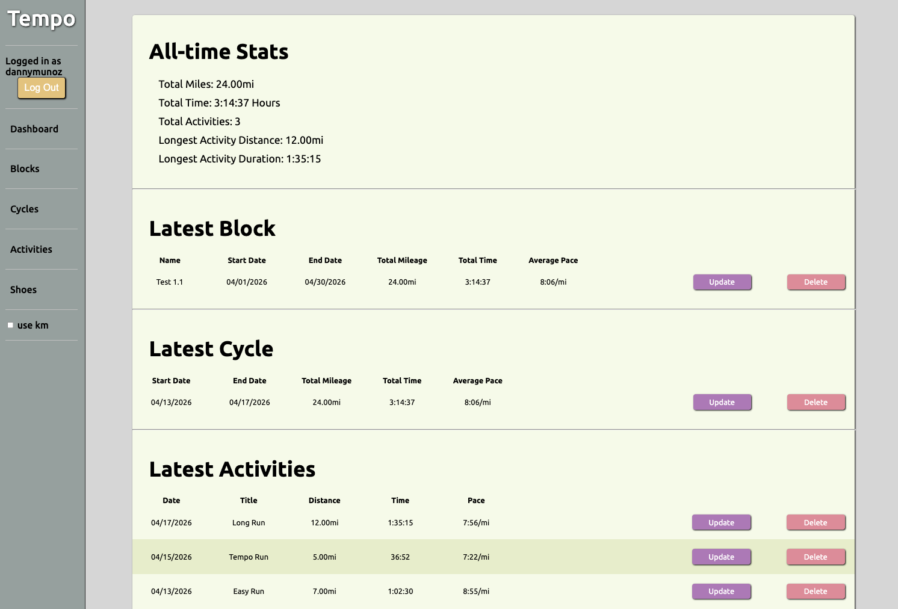

# Tempo
### Running Log and Planner

---
## About


Tempo is a modular running log designed to break the standard 7-day week constraint. Create custom **Cycles** of any 
duration—whether it's a 3-day recovery microcycle or a 15-day training stretch—Tempo adapts to your rhythm, not the 
calendar.

### Key Highlights:

- **Custom Periodization**: Create training blocks and cycles with custom date ranges to fit your training needs.
- **Granular Logging**: Breakdown complex workouts into segments (Warm-up, Intervals, Cool-down) for precise pace and performance tracking.
- **Seamless Unit Toggling**: Switch between Imperial and Metric systems on the fly; all data is stored in miles to ensure consistency while offering a flexible UI.
- **Live Dashboard**: Get an immediate overview of all-time statistics and quick-access views of your most recent training data.


---
## Built With
Django - Backend Framework

PostgreSQL - Database

Vanilla JS - Dynamic UI Interactions & Unit Conversions

Upsun (Platform.sh) - Deployment

---
## Getting Started

### Web Version: 
https://main-bvxea6i-4me5w5cerszyu.us-4.platformsh.site/

### Local Development
*Note: This app is optimized for deployment on Upsun. A `.env` file is required for local configuration.*

#### 1. Prerequisites
- Python 3.14+
- PostgreSQL 14+
- A Database User with `CREATEDB` permissions.

#### 2. App Setup
```bash
# Clone and enter repository
git clone https://github.com/muno17/Tempo.git
cd Tempo

# Set up virtual environment
python -m venv .venv
source .venv/bin/activate  # Windows: .venv\Scripts\activate

# Install dependencies
pip install -r requirements.txt
```
#### 3. Environment & Database
1. Create a local database: `createdb run_tracker_db`

2. Create a `.env` file based on `.env.example` with your DB credentials.

3. Initialize the database and start the server:
```bash
python manage.py migrate
python manage.py runserver
```
---
## Usage
Data Hierarchy:
```
Block (Macrocycle)
└── Cycle (Microcycle)
    └── Activity (A Run)
        └── Segments (Intervals/Splits)
```


1. **Flexible Access**: Sign up for a personal account or use the **Demo Account** (automatic if not logged in). 
*Note: The demo account is shared among all guest users.*
2. **Shoe Tracking**: (Optional) Track gear mileage. It is recommended to add your shoes before logging activities to ensure accurate gear stats.
3. **Training Blocks**: Define high-level goals (e.g., "Spring Marathon Prep"). Blocks aggregate data from multiple cycles to show long-term progress.
4. **Custom Cycles**: Define your 'Microcycle' - set any start and end date to suit your specific training needs.
5. **Multi-Segment Activities**: Log your runs. You can add up to 10 Segments per activity to track intervals, warm-ups, or splits within a single session.

### Unit Conversions & Precision
Tempo supports both **Miles** and **Kilometers**. 
- **Storage**: All data is stored as Miles in the database.
- **Conversion**: Toggling to KM uses a real-time conversion which may result in minor rounding differences (e.g., 10km might display as 9.99km) due to standard float precision.
- ***Note**: Set your preferred unit *before* entering activity forms to ensure correct data entry.*


